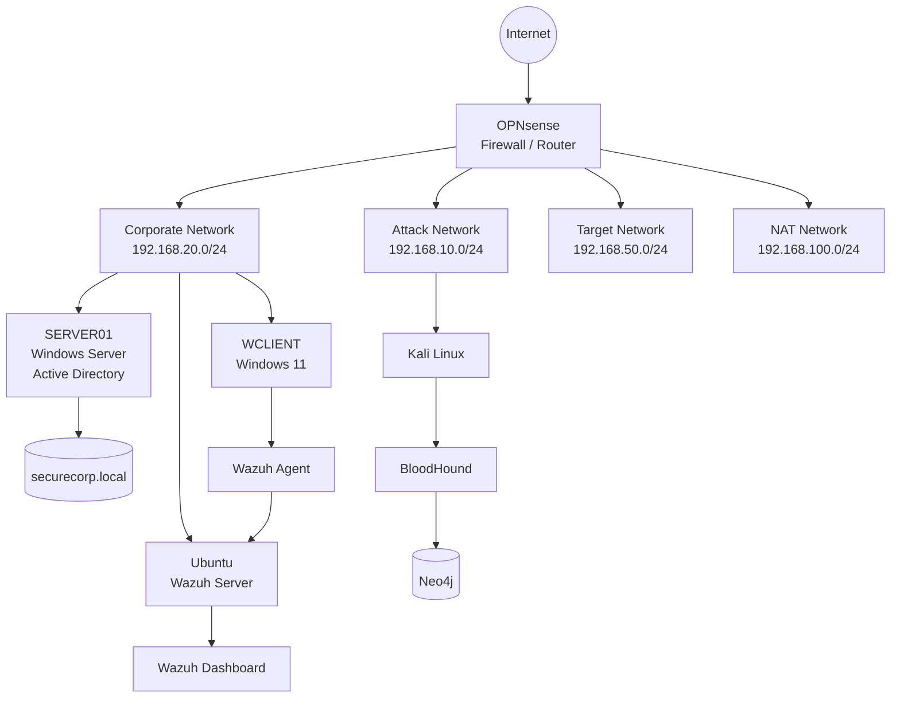
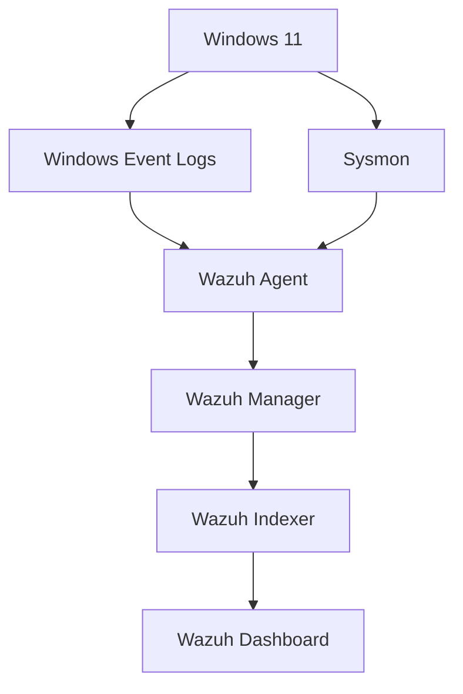
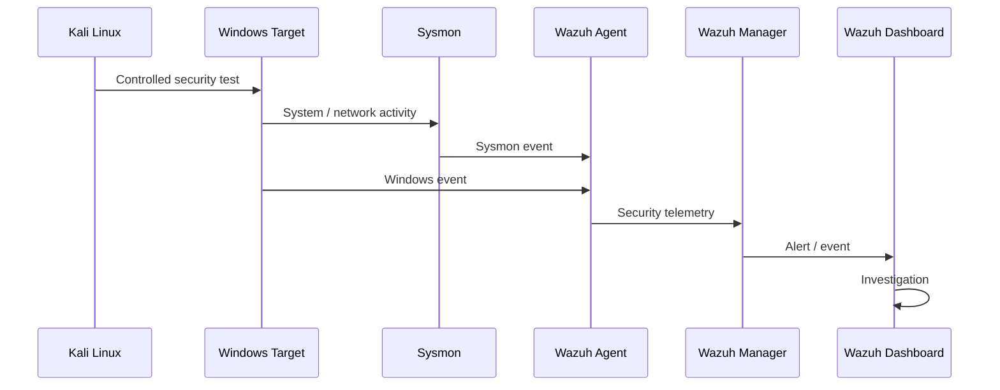

# 🛡️ SecureCorp Cybersecurity Lab

<p align="center">


</p>

<p align="center">
  <b>Enterprise Cybersecurity Laboratory for Offensive Security, Defensive Security, SIEM, Active Directory and Endpoint Monitoring</b>
</p>

---

## 📌 Table of Contents

* [📖 Project Overview](#-project-overview)
* [🎯 Objectives](#-objectives)
* [🏗️ Architecture](#️-architecture)
* [🌐 Network Architecture](#-network-architecture)
* [💻 Virtual Machines](#-virtual-machines)
* [🗂️ Active Directory](#️-active-directory)
* [🛡️ Wazuh](#️-wazuh)
* [⚔️ Offensive Security](#️-offensive-security)
* [📸 Evidence and Screenshots](#-evidence-and-screenshots)
* [📁 Repository Structure](#-repository-structure)
* [🧰 Tools and Technologies](#-tools-and-technologies)
* [⚖️ Ethical Statement](#️-ethical-statement)
* [👩‍💻 Author](#-author)

---

# 📖 Project Overview

**SecureCorp Cybersecurity Lab** is an isolated enterprise cybersecurity laboratory designed to reproduce a small corporate IT infrastructure in a controlled virtual environment.

The project combines **network security, Active Directory, offensive security, endpoint monitoring, SIEM, system telemetry and security assessment**, built on VirtualBox with the network segmented behind an OPNsense firewall.

```text
Infrastructure
      ↓
Network Segmentation
      ↓
Active Directory
      ↓
Endpoint Monitoring
      ↓
Security Testing
      ↓
Telemetry Collection
      ↓
Detection
      ↓
Investigation
      ↓
MITRE ATT&CK Analysis
```

Full technical write-up: [`docs/SecureCorp-Lab-Technical-Report.md`](docs/SecureCorp-Lab-Technical-Report.md)

---

# 🎯 Objectives

## Infrastructure
* Build an enterprise-like virtual infrastructure with OPNsense as firewall/router.
* Segment the laboratory into multiple networks.
* Deploy Windows Server, a Windows 11 workstation, Kali Linux and an Ubuntu Wazuh server.

## Active Directory
* Create the `securecorp.local` domain and configure AD DS.
* Create users, groups, and Organizational Units.
* Join Windows clients to the domain.
* Analyze AD relationships using BloodHound.

## Defensive Security
* Deploy Wazuh, register Windows endpoints, and collect Windows events.
* Configure File Integrity Monitoring and Security Configuration Assessment.
* Install Sysmon and collect detailed endpoint telemetry.
* Investigate security alerts.

## Offensive Security
* Perform controlled network reconnaissance and service enumeration.
* Perform controlled authentication tests.
* Generate endpoint/network telemetry and analyze it from the defensive side.

---

# 🏗️ Architecture



Full diagram: [`architecture/network-topology.png`](architecture/network-topology.png)

---

# 🌐 Network Architecture

| Network            | CIDR                | Purpose                 |
| ------------------- | -------------------- | ------------------------ |
| NAT Network          | `192.168.100.0/24`   | Internet connectivity     |
| Corporate Network    | `192.168.20.0/24`    | Enterprise systems        |
| Attack Network       | `192.168.10.0/24`    | Offensive security        |
| Target Network       | `192.168.50.0/24`    | Isolated targets          |
| Host-only            | `192.168.56.0/24`    | Host/lab communication    |

```text
                         ┌──────────────────┐
                         │     INTERNET     │
                         └────────┬─────────┘
                                  │
                                  ▼
                         ┌──────────────────┐
                         │    OPNsense      │
                         │ Firewall/Router  │
                         └───────┬──────────┘
                                 │
            ┌────────────────────┼────────────────────┐
            │                    │                    │
            ▼                    ▼                    ▼
     Corporate NET          Attack NET           Target NET
    192.168.20.0/24       192.168.10.0/24      192.168.50.0/24
            │                    │                    │
       ┌────┼────┐               │               ┌────┘
       │    │    │               │               │
       ▼    ▼    ▼               ▼               ▼
      AD   W11  Wazuh          Kali            Targets
```

---

# 💻 Virtual Machines

| Machine  | OS                 | Role                        | IP                 |
| -------- | ------------------- | ---------------------------- | ------------------- |
| OPNsense | OPNsense            | Firewall / Router            | 192.168.20.1 (corp)  |
| SERVER01 | Windows Server       | Domain Controller / DNS      | 192.168.20.10        |
| WCLIENT  | Windows 11           | Corporate Endpoint           | 192.168.20.20        |
| Wazuh    | Ubuntu               | SIEM / Security Monitoring   | 192.168.20.116       |
| Kali     | Kali Linux           | Offensive Security           | 192.168.10.100       |
| Target   | Windows/Linux        | Security Testing Target      | 192.168.50.X          |

---

# 🗂️ Active Directory

Domain: `securecorp.local` — controller: `SERVER01`.

Detailed docs:
* [`active-directory/domain-structure.md`](active-directory/domain-structure.md) — domain, OUs, DNS
* [`active-directory/users-and-groups.md`](active-directory/users-and-groups.md) — accounts and security groups
* [`active-directory/organizational-units.md`](active-directory/organizational-units.md) — OU layout
* [`active-directory/bloodhound-analysis.md`](active-directory/bloodhound-analysis.md) — AD relationship and privilege-path analysis via BloodHound/Neo4j

---

# 🛡️ Wazuh

Wazuh is the central SIEM of the lab, deployed as an All-in-One stack (Manager, Indexer, Dashboard) on Ubuntu.



Detailed docs:
* [`wazuh/installation.md`](wazuh/installation.md) — server setup
* [`wazuh/agent-deployment.md`](wazuh/agent-deployment.md) — Windows agent registration
* [`wazuh/sysmon.md`](wazuh/sysmon.md) — Sysmon install, config, Event IDs
* [`wazuh/fim.md`](wazuh/fim.md) — File Integrity Monitoring tests
* [`wazuh/sca.md`](wazuh/sca.md) — Security Configuration Assessment (CIS Benchmark)
* [`wazuh/detection-rules.md`](wazuh/detection-rules.md) — custom/triggered detection rules

---

# ⚔️ Offensive Security

Kali Linux is the offensive platform. All testing targets systems belonging to the isolated SecureCorp lab only.



Detailed docs:
* [`offensive-security/reconnaissance.md`](offensive-security/reconnaissance.md) — recon methodology
* [`offensive-security/nmap.md`](offensive-security/nmap.md) — scan results and analysis
* [`offensive-security/authentication-testing.md`](offensive-security/authentication-testing.md) — controlled auth-failure testing (Event ID 4625)
* [`offensive-security/attack-scenarios.md`](offensive-security/attack-scenarios.md) — full attack → detection scenarios

---

# 📸 Evidence and Screenshots

All screenshots live under [`evidence/screenshots/`](evidence/screenshots/), organized by category:

```text
evidence/screenshots/
├── 01-infrastructure/
├── 02-network/
├── 03-active-directory/
├── 04-bloodhound/
├── 05-wazuh/
├── 06-sysmon/
├── 07-fim/
└── 08-offensive-security/
```

Example embed:

```markdown

```

---

# 📁 Repository Structure

```text
SecureCorp-Cybersecurity-Lab/
│
├── README.md
├── LICENSE
│
├── docs/
│   └── SecureCorp-Lab-Technical-Report.md
│
├── architecture/
│   └── network-topology.png
│
├── active-directory/
│   ├── bloodhound-analysis.md
│   ├── domain-structure.md
│   ├── organizational-units.md
│   └── users-and-groups.md
│
├── wazuh/
│   ├── agent-deployment.md
│   ├── detection-rules.md
│   ├── fim.md
│   ├── installation.md
│   ├── sca.md
│   └── sysmon.md
│
├── offensive-security/
│   ├── attack-scenarios.md
│   ├── authentication-testing.md
│   ├── nmap.md
│   └── reconnaissance.md
│
└── evidence/
    └── screenshots/
```

---

# 🧰 Tools and Technologies

**Infrastructure:** VirtualBox, OPNsense, Windows Server, Windows 11, Ubuntu, Kali Linux
**Networking:** IPv4, TCP/IP, DNS, routing, firewalling, network segmentation
**Active Directory:** AD DS, DNS, Users, Groups, OUs, Group Policy
**Offensive Security:** Nmap, BloodHound, bloodhound-python
**Defensive Security:** Wazuh, Sysmon, Windows Event Logs, FIM, SCA
**Threat Detection:** MITRE ATT&CK, Windows Event IDs, process/network/authentication monitoring

---

# ⚖️ Ethical Statement

This project is strictly designed for **educational and defensive cybersecurity purposes**.

All security testing is performed inside an isolated virtual laboratory controlled by the project author. The offensive activities described in this repository demonstrate how attacks generate telemetry, how endpoint activity can be monitored, how security alerts are generated, and how defensive controls can be validated.

No unauthorized systems, networks or accounts are targeted.

---

# 👩‍💻 Author

**Fatima Ezzahrae Ouhmich**

🎓 Cybersecurity  Engineering Student


---
